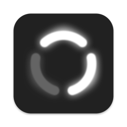

  

  # RingLight

  A macOS menu bar utility that displays a customizable ring light overlay on your screen.

  

## About

RingLight provides an adjustable circular ring overlay that can be used as a visual indicator or ring light effect on your desktop. The app sits in your menu bar and allows you to control the ring's appearance and position through an intuitive interface.

---

Built by Aayush Pokharel
[apps.aayush.art](https://apps.aayush.art)
